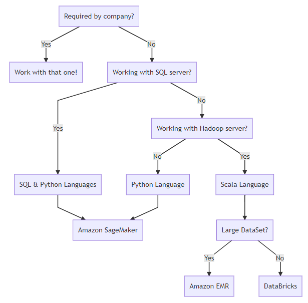

# Part2. Big Data Options Answer

## Platforms

I think in the future, I would stick to Amazon SageMaker as much as possible. This is because I like Python more than Scala and found it slightly easier in starting/stopping clusters and notebooks. Also, there is much more available manipulation in the environment (`conda install` etc.) and multiple notebooks can be made in the same environment so that new libraries can be added to the multiple different notebooks.

## Libraries

I thoroughly enjoyed Numba and Dask, and have yet to play around with MapReduce or PySpark much, but am looking forward to it. I thoroughly enjoy the idea of code that can be run on a distributed platform, but don't have enough information yet on when and where I would use each library. However, I do know that for dataframe work, I would definitely choose Dask over Numba w/ other libraries.

## Languages

I taught myself Python a long time ago, and it is still the main programming language that I know and use today. However, there are some downsides:

  1. Difficult to distribute. Code needs to be changed if instead of running locally on one core, you need to run it distributed on multiple cores. For this, I do enjoy scala and the fact you don't need to change anything in scaling out/up.

  2. Working with existing architecture. Most of the time, some variant of a SQL database if locked in to a company's workflow. It makes things a lot easier to manipulate and grab data using SQL, rather than using a Python library.

## Decision Making Graph

